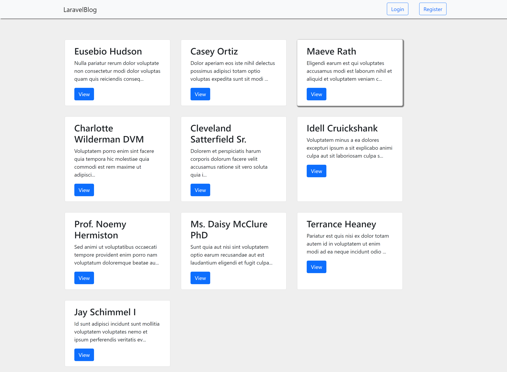
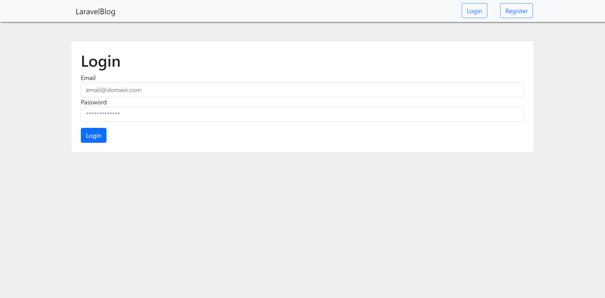
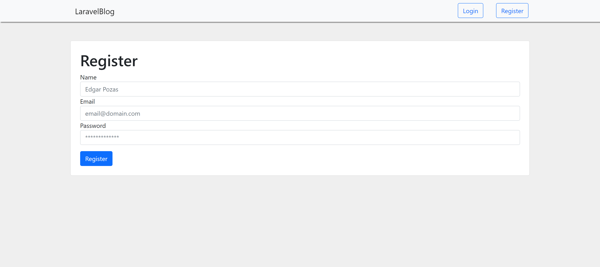
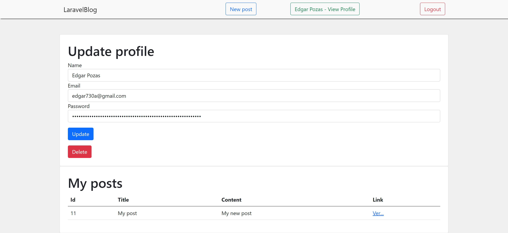
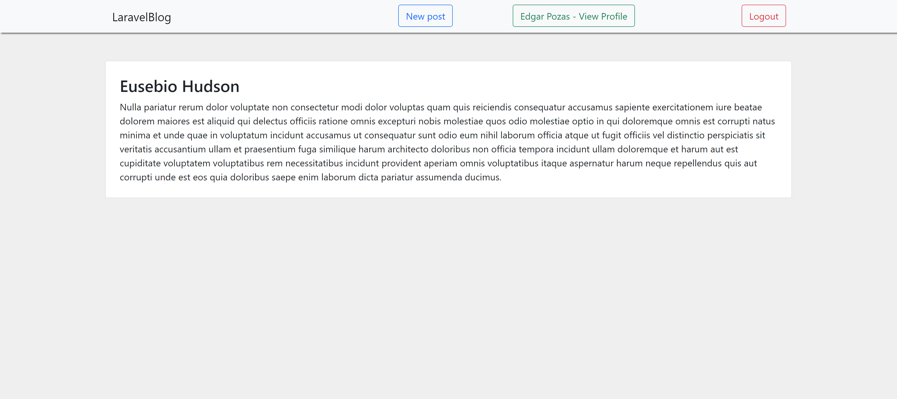
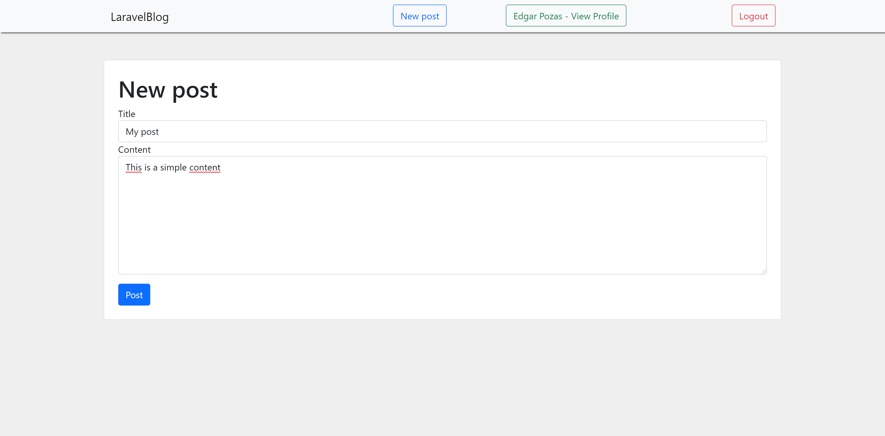
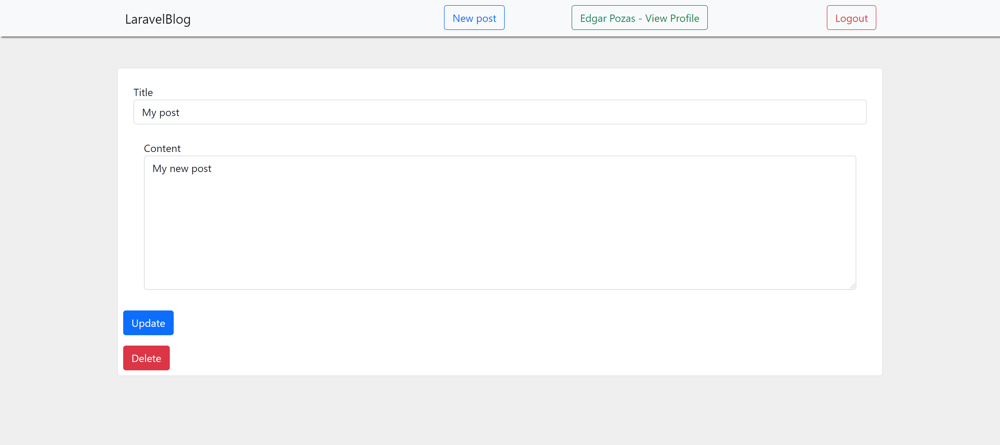

# BlogWithLaravel

This is a implementation of a Blog With Laravel

## Requirements

You need the following programs:
* Apache server (>=2.4.0)
* MySQL (>=10.4.0)
* PHP (>=8.0.0)
* Laravel (>=8.0)
* Bootstrap (>=5.0.0)

## Installation

First download or clone the repository. Next to place inside the folder.

## Pre-run

First we have to run the next commands to install the dependencies:

```bash
composer dump
```

## Run

In order to start the server, run the following command:

```bash
php artisan serve
```

## Views
Main


Login


Register


Profile


Individual post


New post


Individual my own

